# Agentic Payments Platform - Technical Documentation

## 🚀 Overview

Agentic Payments is an AI-native Accounts Payable (AP) operating system designed for supply chain businesses. It automates invoice processing, payment orchestration, and reconciliation through intelligent agents, including browser automation for API-less systems like Famous ERP.

### Key Capabilities
- 📄 **Intelligent Document Processing** - OCR + LLM-powered extraction
- 🤖 **Browser Automation** - Agent-based ERP integration for systems without APIs
- 💳 **Multi-Rail Payments** - ACH, RTP, Check, Wire, Stablecoin (USDC)
- ✅ **Auto-Reconciliation** - 95% target with three-way matching
- 📊 **Complete Audit Trail** - Immutable event logging for compliance

---

## 📚 Documentation Structure

### [1. Technical Architecture](./TECHNICAL_ARCHITECTURE.md)
Comprehensive system design including data models, technology stack, and implementation roadmap.


**Contents:**
- System Architecture Overview
- Detailed Data Models (9 core entities)
- Technology Stack Recommendations
- Agentic Workflow Implementation
- API Architecture (REST + GraphQL)
- Security & Compliance Design
- 24-Week Implementation Roadmap

---

### [2. System Architecture Diagrams](./SYSTEM_ARCHITECTURE_DIAGRAMS.md)
Visual representations of all system components and their interactions.


**Contents:**
- Complete System Architecture
- Entity Relationship Diagrams
- Document Processing Flow
- Payment Orchestration
- Browser Automation Workflows
- Reconciliation Process
- Integration Architecture
- Security & Audit Flow

---

### [3. Swimlane Process Diagrams](./SWIMLANE_PROCESS_DIAGRAMS.md)
Cross-functional process flows showing interactions between actors and systems.


**Contents:**
- End-to-End Invoice Processing
- Payment Execution Workflow
- Three-Way Reconciliation
- Vendor Onboarding & KYB
- Famous ERP Browser Automation
- Policy Exception Handling
- Document Matching & Disputes
- Multi-Channel Payment Scheduling

---

## 🎯 Quick Start Guide

### For Different Roles

#### 🔧 **Engineers & Developers**
Start with [Technical Architecture](./TECHNICAL_ARCHITECTURE.md) for:
- Data models and schemas
- API specifications
- Integration examples
- Code samples for agents

#### 🏗️ **System Architects**
Review [System Architecture Diagrams](./SYSTEM_ARCHITECTURE_DIAGRAMS.md) for:
- High-level system design
- Component interactions
- Integration points
- Security architecture

#### 💼 **Product & Business Teams**
Explore [Swimlane Process Diagrams](./SWIMLANE_PROCESS_DIAGRAMS.md) for:
- Business workflows
- User journeys
- Cross-functional processes
- Exception handling

---

## 🔑 Core Workflows

### 1. Invoice to Payment Flow

```mermaid
flowchart LR
    A[📧 Invoice] --> B[🤖 OCR/AI]
    B --> C[🔍 Match PO]
    C --> D[📋 Policy]
    D --> E[✅ Approve]
    E --> F[💳 Payment]
    F --> G[📊 Reconcile]
```


### 2. Browser Automation Flow

```mermaid
flowchart LR
    A[🎯 Task] --> B[🤖 Agent]
    B --> C[🔐 Login]
    C --> D[🖱️ Navigate]
    D --> E[📝 Execute]
    E --> F[📸 Capture]
    F --> G[✅ Verify]
```


### 3. Payment Rails


---

## 🛠️ Technology Stack

### Core Technologies
- **Backend:** TypeScript, Fastify, MongoDB
- **AI/ML:** GPT-4, Claude, Textract OCR
- **Browser Automation:** Playwright
- **Payments:** Astra (ACH/RTP), Bridge (Stablecoin)
- **Frontend:** Vite, React 18, Tailwind CSS
- **Backend Framework:** Fastify, Node.js

### Key Integrations
- **ERP:** QuickBooks, NetSuite, Famous (via browser)
- **Banking:** Plaid, Direct Bank APIs
- **Documents:** AWS S3, Textract
- **Security:** Auth0, AWS KMS

---

## 📊 Data Model Overview

### Core Entities


### Key Models
1. **Vendor** - Complete vendor profile with KYB, banking, contacts
2. **Purchase Order** - POs with line items, approvals, status tracking
3. **Bill** - Invoices with OCR results, matching, policy evaluation
4. **Payment** - Multi-rail payments with execution tracking
5. **Reconciliation** - Three-way matching records
6. **Agent Execution** - Browser automation audit trail
7. **Policy Rule** - Configurable business rules
8. **Audit Event** - Immutable compliance logging

---

## 🎨 Agent Architecture

### Agent Types

#### 1. Document Processing Agent
- Handles OCR and data extraction
- Uses LLM for complex documents
- Validates and matches data

#### 2. Browser Automation Agent
- Manages Famous ERP integration
- Handles login, navigation, data entry
- Captures screenshots for audit

#### 3. Communication Agent
- Processes vendor emails
- Generates responses
- Handles disputes

#### 4. Reconciliation Agent
- Performs three-way matching
- Updates ERP systems
- Resolves exceptions

---

## 📈 Implementation Phases

### Phase 1: Foundation (Weeks 1-4)
- Infrastructure setup
- Core data models
- Basic authentication

### Phase 2: Document Processing (Weeks 5-8)
- OCR integration
- Matching engine
- Exception handling

### Phase 3: Payment Engine (Weeks 9-12)
- Provider integrations
- Payment scheduling
- Basic reconciliation

### Phase 4: Browser Automation (Weeks 13-16)
- Famous ERP agent
- Screenshot capture
- Error recovery

### Phase 5: Policy & Compliance (Weeks 17-20)
- Policy engine
- Approval workflows
- Audit trail

### Phase 6: UI & Integration (Weeks 21-24)
- Frontend development
- Testing & optimization
- Production deployment

---

## 🔍 Key Features

### Intelligent Processing
- **Line-level OCR matching** with configurable tolerances
- **ML-powered anomaly detection** for fraud prevention
- **Auto-learning** from manual corrections

### Payment Optimization
- **Multi-rail orchestration** for optimal routing
- **Cash flow optimization** with discount capture
- **Check float management** for working capital

### Compliance & Security
- **Immutable audit trail** with cryptographic proofs
- **Field-level encryption** for sensitive data
- **Role-based access control** with MFA

### Integration Flexibility
- **API-first** for modern systems
- **Browser automation** for legacy systems
- **Webhook support** for real-time updates

---

## 📝 Sample Data & Testing

### Test Vendor Example
```json
{
  "id": "v_01J7XQWERTY123456",
  "legalName": "Global Suppliers Inc.",
  "status": "active",
  "paymentPreferences": {
    "defaultMethod": "ACH",
    "paymentTerms": "Net30"
  },
  "bankAccounts": {
    "domestic": [{
      "type": "ACH",
      "verificationStatus": "verified"
    }]
  }
}
```

### Test Purchase Order
```json
{
  "id": "po_01J7XQPO123456",
  "poNumber": "PO-2025-001234",
  "vendorId": "v_01J7XQWERTY123456",
  "amounts": {
    "subtotal": 10000.00,
    "tax": 875.00,
    "total": 11125.00
  },
  "status": {
    "current": "approved"
  }
}
```

---

## 🚦 Success Metrics

### MVP Targets
- ✅ **95%** auto-reconciliation rate
- ⏱️ **<2 hours** data freshness
- 🎯 **90%** invoice auto-processing
- 💯 **99%** payment success rate
- 📊 **100%** audit trail coverage

### Performance Requirements
- **API Response:** <500ms p95
- **Page Load:** <2s for 5k records
- **Export:** <60s for 50k rows
- **Availability:** 99.0% monthly

---

## 🤝 Contributing

This documentation is part of the Agentic Payments platform development. For questions or contributions:

1. Review the technical architecture
2. Understand the data models
3. Follow the implementation roadmap
4. Ensure compliance with security requirements

---

## 📞 Contact & Support

For technical questions about:
- **Architecture:** Review [Technical Architecture](./TECHNICAL_ARCHITECTURE.md)
- **Workflows:** See [Swimlane Diagrams](./SWIMLANE_PROCESS_DIAGRAMS.md)
- **Integrations:** Check [System Diagrams](./SYSTEM_ARCHITECTURE_DIAGRAMS.md)

---

## 🔗 Quick Links

- [Complete Technical Architecture →](./TECHNICAL_ARCHITECTURE.md)
- [System Architecture Diagrams →](./SYSTEM_ARCHITECTURE_DIAGRAMS.md)
- [Process Swimlane Diagrams →](./SWIMLANE_PROCESS_DIAGRAMS.md)

---

*Last Updated: September 2025*
*Version: 1.0.0*