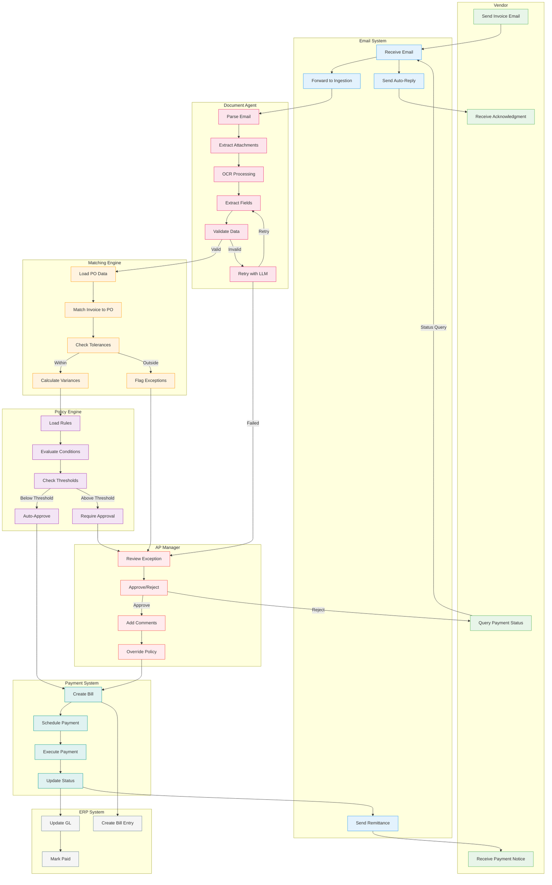
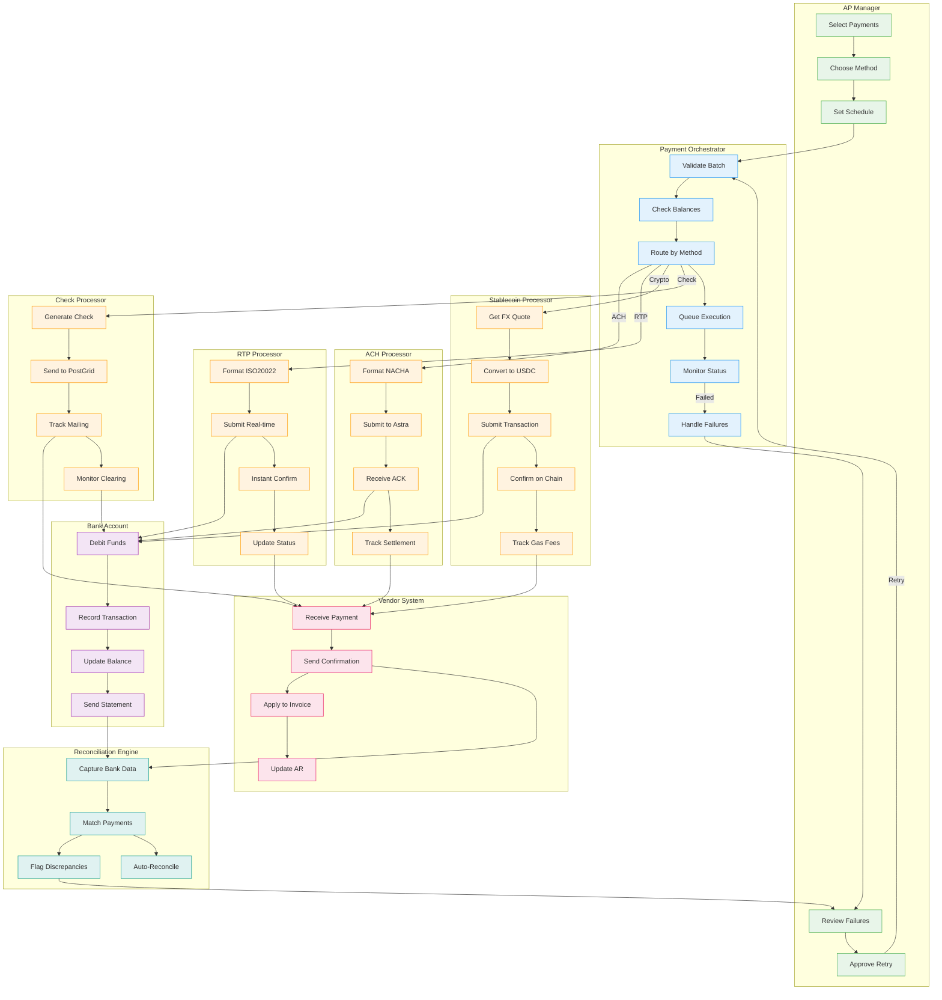
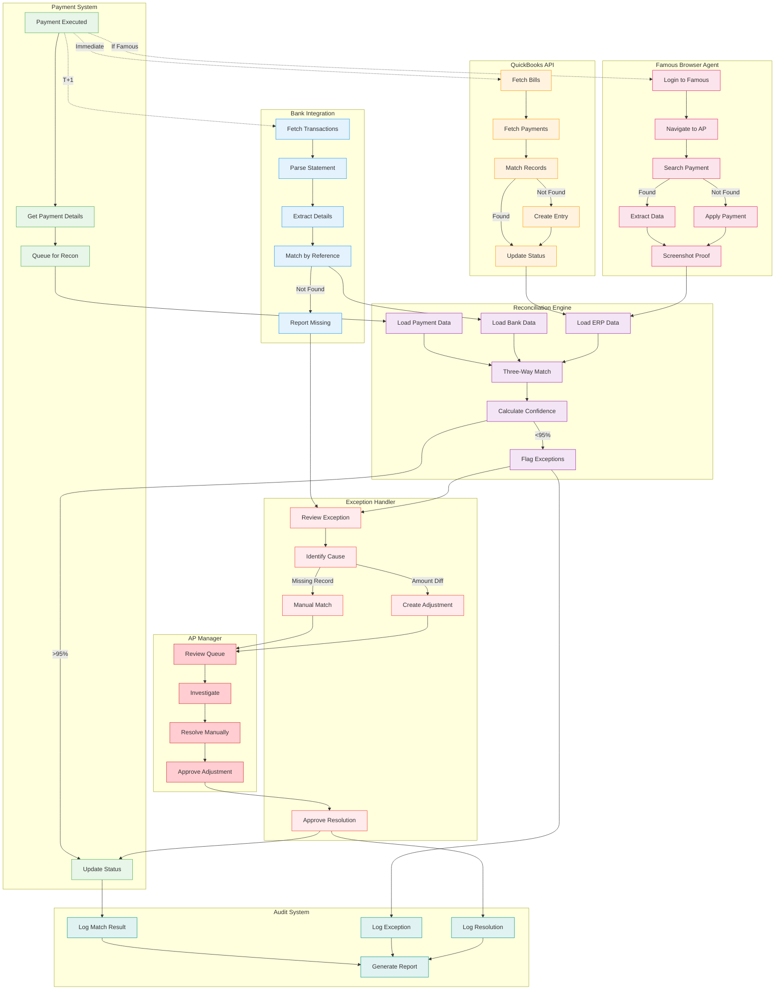
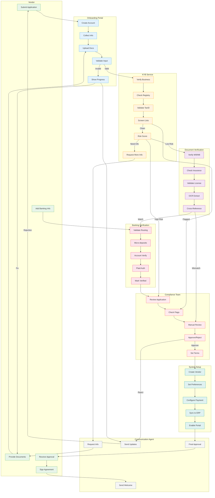
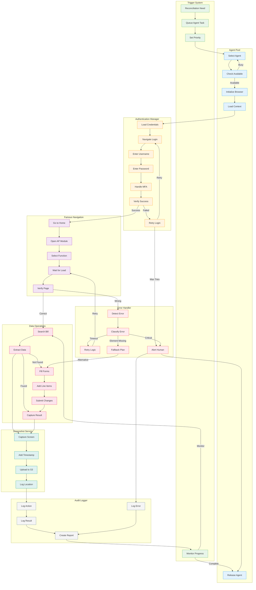
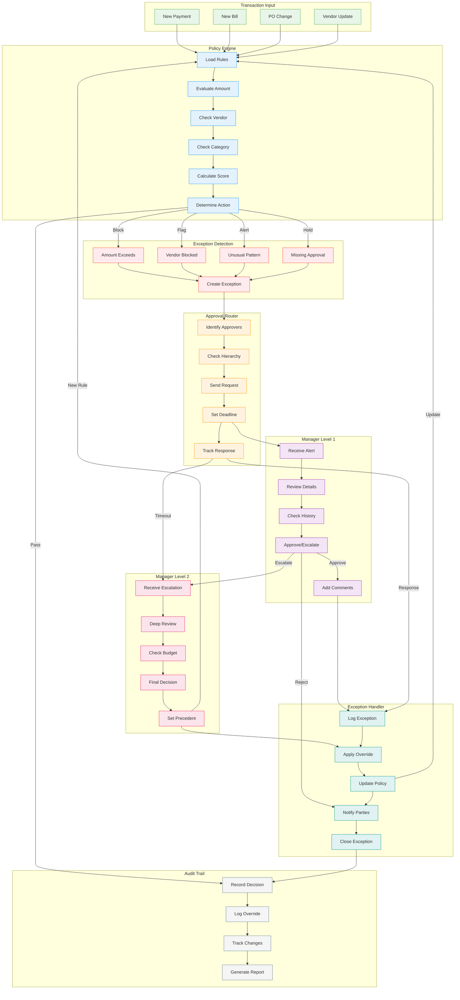
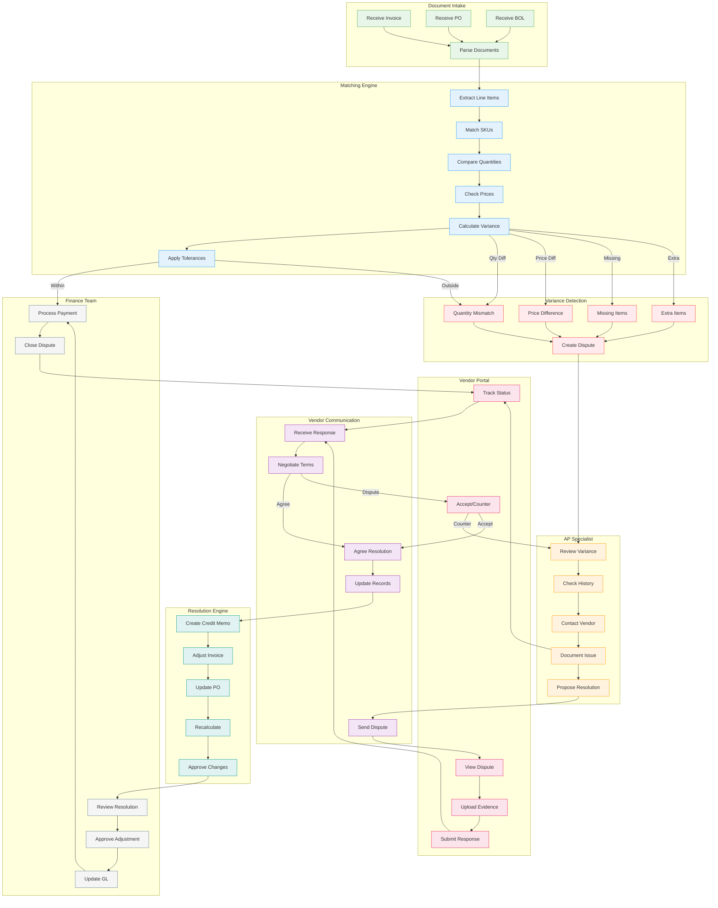
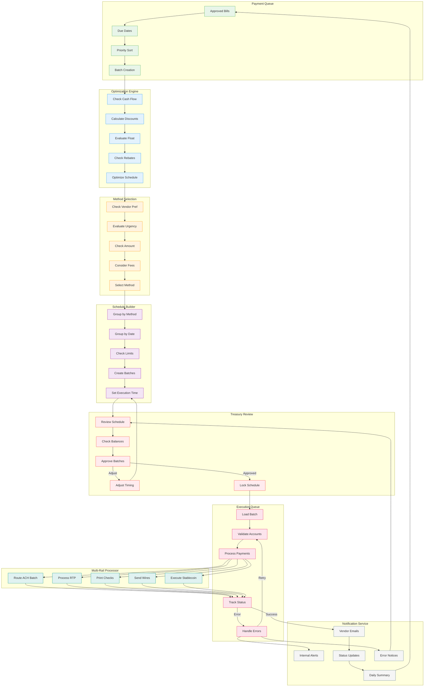

# Agentic Payments - Swimlane Process Diagrams

## Table of Contents
1. [End-to-End Invoice Processing](#end-to-end-invoice-processing)
2. [Payment Execution Workflow](#payment-execution-workflow)
3. [Three-Way Reconciliation Process](#three-way-reconciliation-process)
4. [Vendor Onboarding & KYB](#vendor-onboarding--kyb)
5. [Famous ERP Browser Automation](#famous-erp-browser-automation)
6. [Policy Exception & Approval Flow](#policy-exception--approval-flow)
7. [Document Matching & Dispute Resolution](#document-matching--dispute-resolution)
8. [Multi-Channel Payment Scheduling](#multi-channel-payment-scheduling)

---

## End-to-End Invoice Processing

---

## Payment Execution Workflow

---

## Three-Way Reconciliation Process

---

## Vendor Onboarding & KYB

---

## Famous ERP Browser Automation

---

## Policy Exception & Approval Flow

---

## Document Matching & Dispute Resolution

---

## Multi-Channel Payment Scheduling

---

## Summary

These swimlane diagrams illustrate the key cross-functional processes in the Agentic Payments platform:

1. **End-to-End Invoice Processing** - Shows the complete flow from vendor invoice submission through payment execution across 8 different actors/systems

2. **Payment Execution Workflow** - Details the multi-rail payment processing with different payment methods (ACH, RTP, Stablecoin, Check) and their respective flows

3. **Three-Way Reconciliation Process** - Illustrates the complex matching between Payment System, Bank, and ERP (both API-based and browser-automated)

4. **Vendor Onboarding & KYB** - Complete vendor onboarding with KYB verification, document checks, and banking validation

5. **Famous ERP Browser Automation** - Detailed browser agent workflow showing authentication, navigation, data operations, and error handling

6. **Policy Exception & Approval Flow** - Multi-level approval routing with exception handling and policy learning

7. **Document Matching & Dispute Resolution** - Variance detection, vendor communication, and dispute resolution process

8. **Multi-Channel Payment Scheduling** - Payment optimization, method selection, and batch execution across multiple payment rails

Each diagram clearly shows:
- **Actors/Systems** in separate swimlanes
- **Process flow** moving forward and backward between lanes
- **Decision points** and conditional logic
- **Error handling** and retry mechanisms
- **Feedback loops** where processes return to earlier stages

The color coding helps distinguish between different types of actors (vendors, agents, humans, systems) making the diagrams easy to follow and understand.