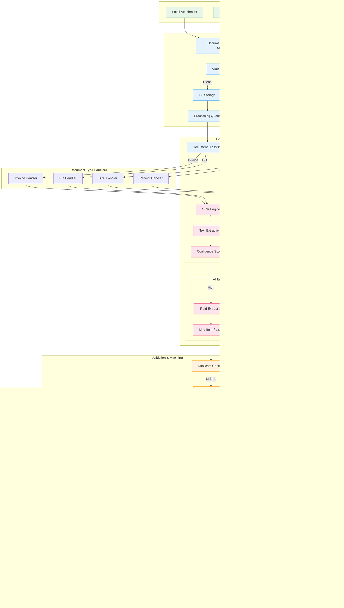

# Agentic Payments - Complete System Architecture Diagrams

## Table of Contents
1. [Complete System Architecture](#complete-system-architecture)
2. [Data Model Relationships](#data-model-relationships)
3. [Document Processing Flow](#document-processing-flow)
4. [Payment Orchestration Flow](#payment-orchestration-flow)
5. [Browser Automation Agent Flow](#browser-automation-agent-flow)
6. [Reconciliation Workflow](#reconciliation-workflow)
7. [Integration Architecture](#integration-architecture)
8. [Security & Audit Flow](#security--audit-flow)

---

## Complete System Architecture

---

## Data Model Relationships

---

## Document Processing Flow

---

## Payment Orchestration Flow

---

## Browser Automation Agent Flow

---

## Reconciliation Workflow

---

## Integration Architecture

---

## Security & Audit Flow

---

## Summary

These comprehensive diagrams provide a complete visual representation of the Agentic Payments platform architecture:

1. **Complete System Architecture** - Shows all layers and components with their interactions
2. **Data Model Relationships** - Entity relationships with complete field definitions
3. **Document Processing Flow** - End-to-end document ingestion, OCR, and matching
4. **Payment Orchestration Flow** - Multi-rail payment execution and settlement
5. **Browser Automation Agent Flow** - Famous ERP integration via browser automation
6. **Reconciliation Workflow** - Three-way matching and exception handling
7. **Integration Architecture** - All external system connections and adapters
8. **Security & Audit Flow** - Complete security, compliance, and audit trail

Each diagram maintains clear separation of concerns with color-coded sections for easy navigation and understanding. The flows demonstrate both happy paths and error handling scenarios, ensuring comprehensive coverage of the system's functionality.